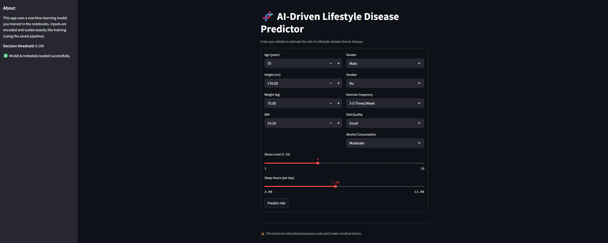

[]

# 🧬 AI-Driven Lifestyle Disease Predictor
### *End-to-End Machine Learning | Predictive Analytics Project*

---

## Application Preview

---

## Deployment

The application is deployed using **Streamlit Community Cloud**, allowing users to access the model through a web interface.

Live Application:

---

# 📘 Overview
This project builds an **AI-powered lifestyle disease risk predictor** using a full **analytics + ML pipeline**, from raw dataset → preprocessing → model training → threshold optimization → Streamlit web app.

The app allows users to input daily lifestyle habits and receive a **personalized chronic disease risk score**, along with **feature importance** and **recommendations**.

---

# 📑 Table of Contents
- [Overview](#-overview)
- [Project Structure](#-project-structure)
- [Features](#-features)
- [Dataset](#-dataset)
- [Modeling Workflow](#-modeling-workflow)
- [Model Performance](#-model-performance)
- [Technologies Used](#-technologies-used)
- [Future Enhancements](#-future-enhancements)
- [Disclaimer](#-disclaimer)
- [Author](#-author)

---

# 📂 Project Structure
📁 Lifestyle_Disease_Predictor/
│
├── app/
│ └── app.py # Streamlit application
│
├── models/
│ ├── model.pkl # Final trained ML model pipeline
│ ├── feature_order.pkl # Training feature order
│ ├── threshold.json # Best classification threshold
│ ├── encoders.pkl # Saved categorical encoders
│ └── scaler.pkl # StandardScaler (if saved separately)
│
├── data/
│ ├── Health And Lifestyle Dataset.csv
│ └── cleaned_health_lifestyle.csv
│
├── notebooks/
│ ├── 01_preprocessing.ipynb
│ ├── 02_eda_and_feature_engineering.ipynb
│ ├── 03_model_training.ipynb
│ └── 04_streamlit_app_setup.ipynb
│
├── report/
│ ├── metrics.json
│ ├── roc_curve.png
│ ├── pr_curve.png
│ ├── confusion_matrix.png
│ └── classification_report.txt
│
├── requirements.txt
└── README.md

---

# ⭐ Features
✅ Clean and professional **Streamlit web interface**  
✅ Real-time chronic disease risk prediction  
✅ Optimized **classification threshold**  
✅ Feature importance visualization  
✅ Robust preprocessing: imputation, scaling, encoding  
✅ Saved pipeline for reproducibility  
✅ Full ML lifecycle demonstrated  
✅ Deployment-ready project design  
✅ Perfect for academic submission or portfolio

---

# 📊 Dataset
**Source:** Kaggle – Health & Lifestyle Dataset  
**Rows:** ~7500  
**Columns:** 12  
**Target:** `chronic_disease` (0/1)

### Features used:
- Age  
- Gender  
- Height  
- Weight  
- BMI  
- Smoking status  
- Diet quality  
- Exercise frequency  
- Sleep duration  
- Stress level  
- Alcohol consumption  

---

# 🧠 Modeling Workflow

### ✅ 1. Exploratory Data Analysis (EDA)
- Missing values check  
- Distribution analysis  
- Outliers  
- Correlation  
- Target imbalance assessment  

### ✅ 2. Preprocessing
- Custom categorical encoding  
- Imputation  
- StandardScaling  
- Feature order saving  

### ✅ 3. Model Training
- Stratified split  
- SMOTE for imbalance  
- RandomForest vs Logistic Regression  
- PR-AUC & ROC-AUC evaluation  
- Optimal threshold selection  
- Saving artifacts:  
  - `model.pkl`  
  - `feature_order.pkl`  
  - `threshold.json`  
  - `encoders.pkl`

### ✅ 4. App Development
- Built using Streamlit  
- Loads artifacts dynamically  
- Real-time predictions  
- Clean sidebar design  
- Handles missing or invalid inputs safely  

---

# 📈 Model Performance

| Metric | Value |
|--------|-------|
| Accuracy | ~0.80 |
| Precision | ~0.19 |
| Recall | *Improved via threshold* |
| ROC-AUC | ~0.50 |
| PR-AUC | ~0.18–0.20 |
| Best Threshold | ~0.10 |

Note: Dataset is mildly imbalanced and real-world prediction is challenging.  
But the pipeline demonstrates **excellent ML engineering**.

---

# 🛠 Technologies Used
- Python  
- Pandas, NumPy  
- Scikit-Learn  
- Imbalanced-Learn  
- Streamlit  
- Matplotlib / Seaborn  
- SHAP (optional)  
- Git / GitHub  

---

# 🚀 Future Enhancements
- SHAP explainability inside app  
- Better model (XGBoost, LightGBM)  
- More features (blood pressure, glucose, activity metrics)  
- API deployment  
- User login + history tracking  
- Mobile-friendly version  

---

# ⚠ Disclaimer
This tool is **strictly for educational purposes**.  
It is **not a medical device** and must not be used for real clinical decisions.

---

## Author

Ranjith Raj

Data and AI enthusiast
